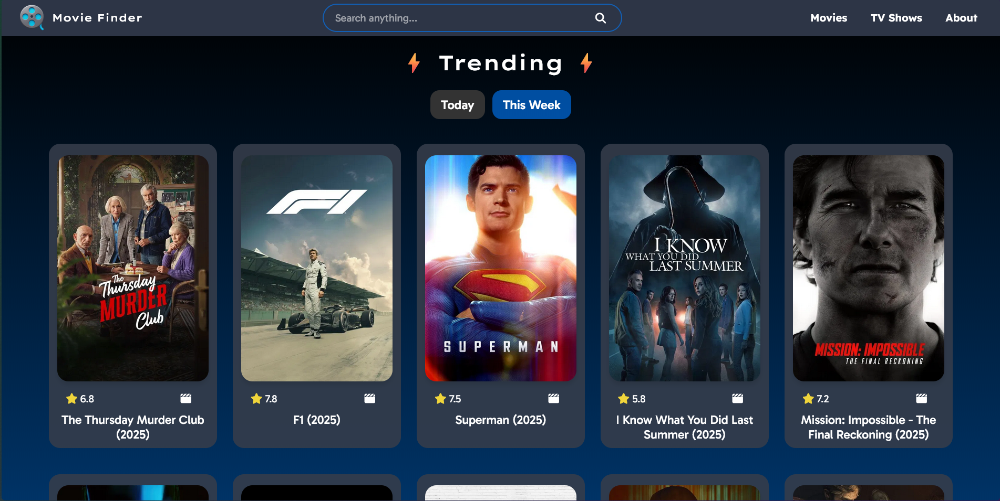
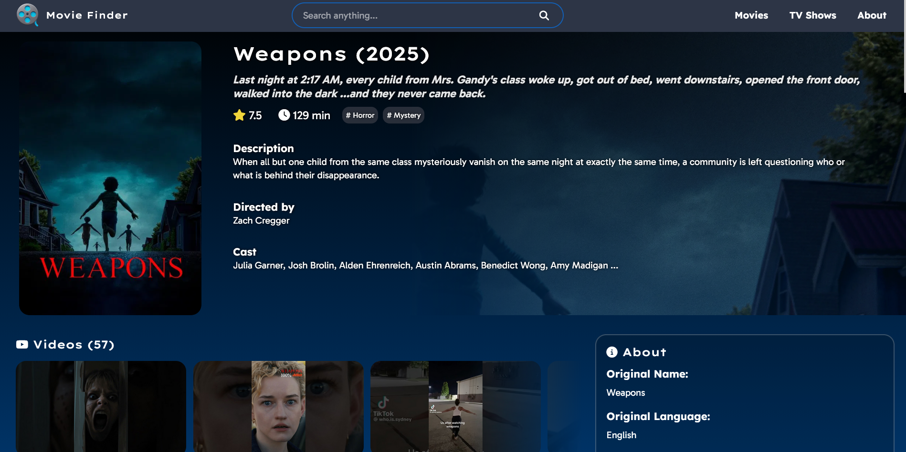
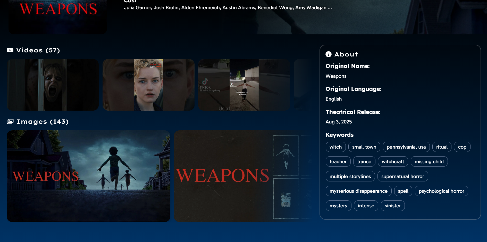

# Movie Finder - Web-Dev Project

<details>
<summary>Screenshots</summary>
<br/>





</details>

## About

This site is a digital hub where users can look up any movie or tv show to get relevant information like cast, ratings, genres, release dates, as well as images and videos. Based on the search, users will also get recommended related content.

This project was originally an assignment from **_"The Complete Full-Stack Web Development Bootcamp"_** by Angela Yu. We were given no starting code and full creative freedom to build it. The goal was to use a free API to build a website, so I decided to go with [TMDB's](https://developer.themoviedb.org/) since I really like movies and shows.

I also opted to not use a styles library and instead write all the css myself, which was a challenge for sure 😅 But it's been very rewarding to see my vision come to life bit by bit.

_Made with Node.js, Express, Ejs and Axios._

## How to run this locally

First you need to have Node.js installed. I'm currently using version `20.18.0`, as well as `npm 10.8.2`

1. Open a new terminal and git clone this repo
   ```bash
   git clone https://github.com/milarr65/Movie-Finder.git
   cd movie-finder
   ```
2. In your terminal run `npm install`. This will install the necessary dependencies.
3. After that's done run `npm run dev`, this will serve the app on [localhost:3000](http://localhost:3000) which you can visit in your browser.
